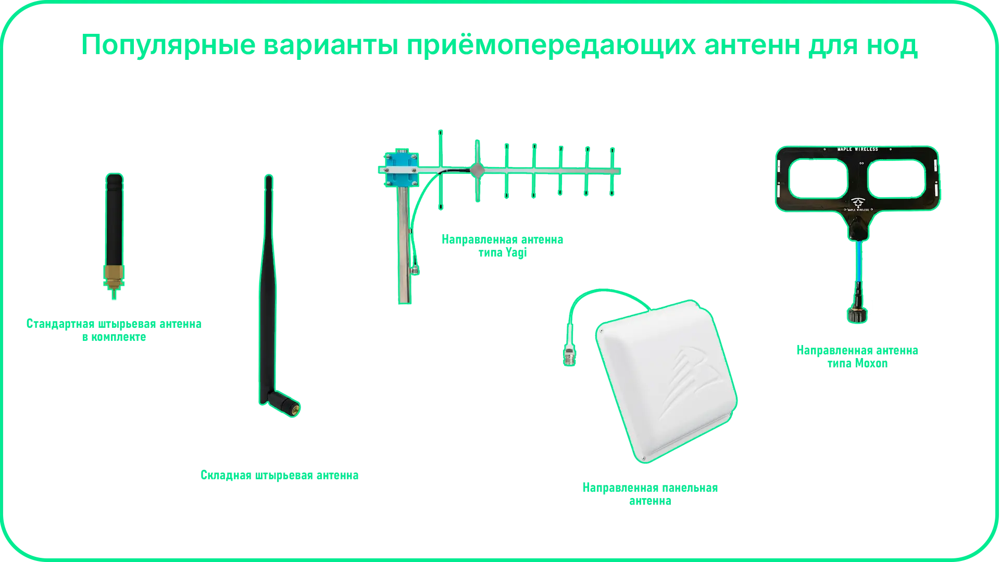

# Антенны
Правильный выбор антенны — один из ключевых факторов, влияющих на дальность и стабильность Meshtastic-сети. Разные типы антенн подходят под разные сценарии использования: от портативных нод до стационарных ретрансляторов.

Практические рекомендации:

  * выбирайте антенну строго под частоту (EU: 868 MHz)
  * избегайте дешёвых no-name антенн
  * минимизируйте длину кабеля (потери сигнала)
  * выносите антенну из корпуса

!!! note "Важно" 
    Даже самая мощная нода не даст хорошего результата с плохой антенной.
    В большинстве случаев замена антенны даёт больший прирост, чем любые настройки прошивки.

---
## Типы антенн

