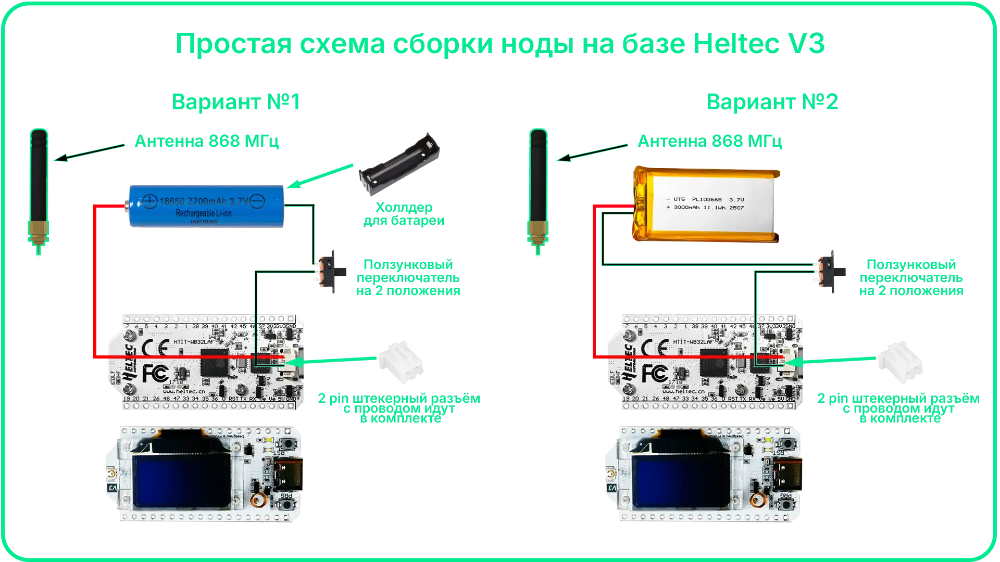
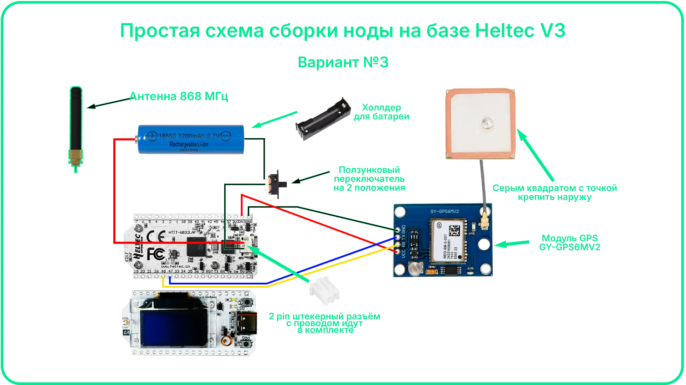
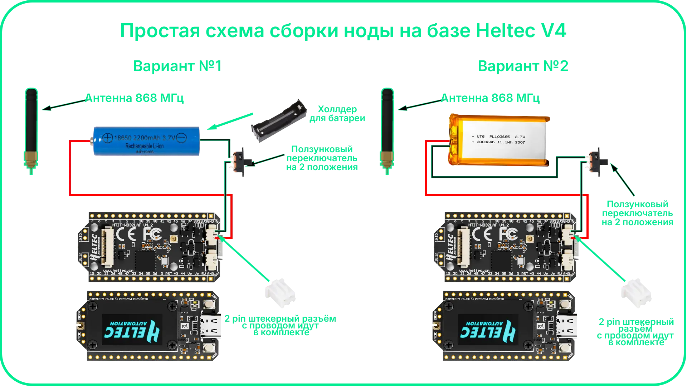
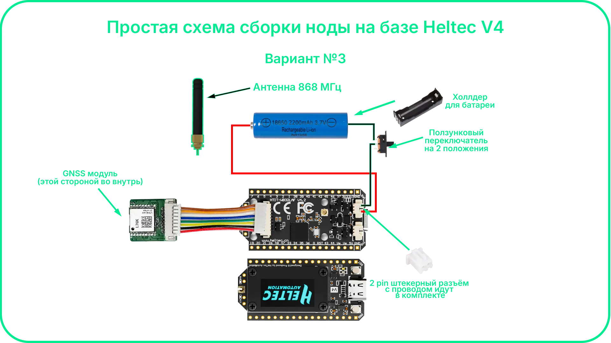

# Платы
В данном разделе приведены схемы подключения основных компонентов к платам Meshtastic на базе ESP32 и nRF52 с поддержкой LoRa. Рассматриваются типовые устройства с интегрированным радиомодулем, дисплеем (опционально) и контроллером питания.

Материалы подходят для большинства популярных плат, используемых в Meshtastic, независимо от производителя и архитектуры (ESP32 или nRF52).

Раздел предназначен для быстрого понимания подключения питания, GPS-модулей и периферийных устройств при сборке DIY-ноды, а также для упрощения настройки, оптимизации энергопотребления и повышения стабильности работы сети.

---
## Heltec V3

**Подключение портативного источника питания к Heltec V3**

Плата Heltec V3 поддерживает питание от LiPo аккумулятора через встроенный JST-разъём. Это позволяет использовать устройство в автономном режиме без подключения к USB.

**Подключение GPS модуля к Heltec V3**

GPS-модуль подключается к плате Heltec V3 через UART интерфейс (TX/RX). Это позволяет получать координаты и использовать их, например, в Meshtastic.

---
## Heltec V4

**Подключение портативного источника питания к Heltec V4**

Плата Heltec V3 поддерживает питание от LiPo аккумулятора через встроенный JST-разъём. Это позволяет использовать устройство в автономном режиме без подключения к USB.

**Подключение GPS модуля к Heltec V4**

GPS-модуль подключается к плате Heltec V3 через UART интерфейс (TX/RX). Это позволяет получать координаты и использовать их, например, в Meshtastic.

