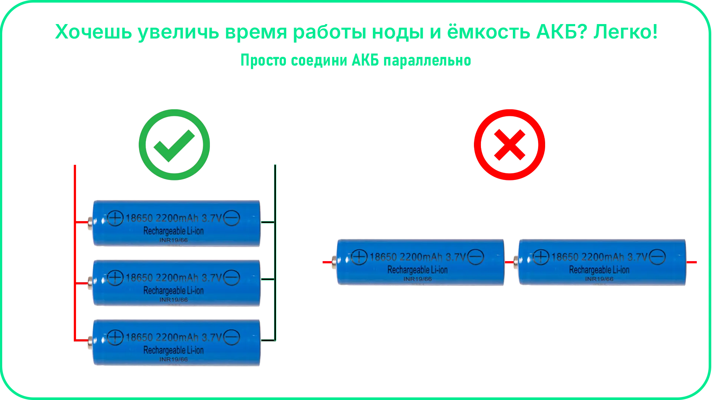

# Питание платы

Плата Meshtastic (например, на базе ESP32) может питаться от различных источников в зависимости от сценария использования: портативная нода, стационарный ретранслятор или автономная установка.

**Основные варианты питания:**

  * LiPo аккумулятор (3.7V) — через встроенный JST-разъём (самый популярный вариант)
  * USB (5V) — для тестирования и стационарной работы
  * Внешние источники питания — через соответствующие пины или модули питания

---
**Рекомендации по питанию:**

  * используйте аккумуляторы с защитой (BMS)
  * избегайте нестабильных источников — это может вызывать перезагрузки
  * учитывайте энергопотребление при включённом GPS и высокой мощности передачи
  * для уличных нод продумайте герметичность и температурный режим

---
## Подключение питания к плате

