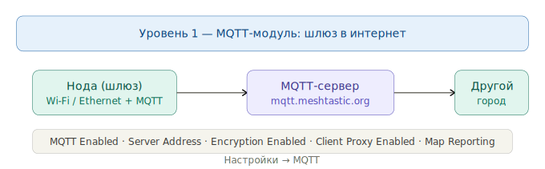

# MQTT в Meshtastic

## Полное руководство для новичков по настройке MQTT в сети Meshtastic.

MQTT — это способ соединить локальную LoRa-сеть Meshtastic с интернетом. Представь это как **общий почтовый ящик где-то в облаке**: ноды из разных городов могут класть туда сообщения и забирать чужие, даже если между ними нет прямой радиосвязи.

---

### Уровень 1 — MQTT-модуль: включить шлюз

Это самый первый шаг. Нода, у которой есть доступ в интернет (через Wi-Fi или Ethernet), может стать **шлюзом (gateway)** — посредником между LoRa-сетью и MQTT-сервером.

**Где настраивается:** Настройки → MQTT (в приложении Android/iOS/Web)

| Параметр | Что делает |
|---|---|
| **MQTT Enabled** | Включает модуль. Без этого нода не подключается к серверу вообще |
| **Server Address** | Адрес MQTT-сервера. По умолчанию `mqtt.meshtastic.org` |
| **Encryption Enabled** | Передавать ли пакеты в зашифрованном виде на сервер |
| **Client Proxy Enabled** | Использовать интернет-соединение телефона вместо Wi-Fi устройства |
| **Map Reporting** | Периодически отправлять позицию нodы на карту (mesh.meshtastic.org) |

!!! note "Важно" 
    Включить MQTT-модуль — это только открыть «канал связи» с сервером. Само по себе это ещё не означает, что чьи-то сообщения будут туда уходить. Для этого нужны настройки уровня 2 и 3.

---

### Уровень 2 — LoRa-настройки: чьи пакеты трогать?

Это настройки на уровне всей ноды, которые определяют её поведение по отношению к MQTT-пакетам в эфире.

**Где настраивается:** Настройки → LoRa

---

#### OK to MQTT

**Это разрешение на выгрузку *твоих* пакетов.**

- `false` (по умолчанию) — ты просишь других участников сети **не выгружать** твои пакеты в MQTT. Это «вежливая просьба», которую официальная прошивка соблюдает.
- `true` — ты разрешаешь любой ноде-шлюзу в сети переслать твои пакеты на MQTT-сервер.

!!! example "Аналогия" 
    Это как пометка на конверте «можно публиковать» или «только для личного использования».

---

#### Ignore MQTT

**Это фильтр входящих пакетов.**

- `false` (по умолчанию) — нода обрабатывает и ретранслирует все пакеты, в том числе те, что пришли из интернета через MQTT.
- `true` — нода **игнорирует и не ретранслирует** любые пакеты, которые где-то на своём пути прошли через MQTT.

!!! example "Аналогия" 
    Если ты не хочешь, чтобы через тебя проходил «интернет-трафик» в радиосеть — включи этот флаг.

#### Матрица поведения ноды

| OK to MQTT | Ignore MQTT | Что происходит |
|:---:|:---:|---|
| `false` | `false` | Твои пакеты не выгружаются. Пакеты из MQTT ты ретранслируешь дальше по радио |
| `true` | `false` | Твои пакеты **могут** быть выгружены шлюзом. Пакеты из MQTT ты ретранслируешь |
| `false` | `true` | Твои пакеты не выгружаются. Пакеты из MQTT ты **блокируешь** |
| `true` | `true` | Твои пакеты **могут** быть выгружены. Пакеты из MQTT ты **блокируешь** |

---

### Уровень 3 — Настройки канала: что именно летит в MQTT?

Это самый «точный» уровень управления. Каждый канал (LongFast, ваш приватный и т.д.) настраивается отдельно.

**Где настраивается:** Настройки → Каналы → выбрать нужный канал

#### Uplink Enabled (Выгрузка наружу)

Сообщения из **этого канала** будут отправляться через шлюз на MQTT-сервер.

- `false` (по умолчанию) — сообщения остаются только в локальной радиосети.
- `true` — сообщения уходят в интернет и становятся доступны всем, кто подключён к тому же MQTT-серверу и каналу.

!!! example "Пример" 
    Ты пишешь сообщение в канал LongFast в Минске. Если Uplink включён — его прочитают люди в Гомеле, у которых есть нода с Downlink на том же канале.

#### Downlink Enabled (Приём снаружи)

Сообщения из MQTT-сервера будут **вводиться в локальную радиосеть** через шлюз.

- `false` (по умолчанию) — из интернета ничего не приходит.
- `true` — шлюз получает сообщения из MQTT и рассылает их по радио твоим соседям.

#### Матрица настроек канала

| Uplink | Downlink | Результат |
|:---:|:---:|---|
| `false` | `false` | Канал полностью изолирован от интернета |
| `true` | `false` | Сообщения **уходят** в MQTT, но из интернета ничего не приходит |
| `false` | `true` | Из интернета сообщения **приходят**, но твои не уходят |
| `true` | `true` | Полноценный двусторонний мост: канал соединён с интернетом |

---
### Ссылки на официальную документацию

- [LoRa-настройки (OK to MQTT, Ignore MQTT)](https://meshtastic.org/docs/configuration/radio/lora/)
- [Настройки каналов (Uplink / Downlink)](https://meshtastic.org/docs/configuration/radio/channels/)
- [MQTT-модуль](https://meshtastic.org/docs/configuration/module/mqtt/)