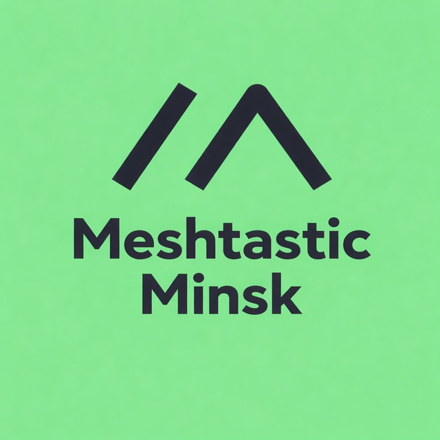

<h1>
    
</h1>

# О нас

Сообщество Meshtastic в Беларуси объединяет людей, интересующихся автономными mesh-сетями и децентрализованной связью.

Мы строим сеть на базе платформы [Meshtastic](https://meshtastic.org/) в городе Минск (РБ), которая использует недорогие LoRa-радиомодули для создания беспроводной сети с большой дальностью действия.

Наша цель — создать устойчивую, децентрализованную и сообщественную сеть, которая может обеспечить связь в условиях отсутствия традиционных сетей, поддерживать местные мероприятия и способствовать сотрудничеству между участниками.

Мы не ограничиваемся только [Meshtastic](https://meshtastic.org/) и также изучаем другие реализации mesh-сетей, такие как [MeshCore](https://meshcore.co.uk/) и подобные проекты. Однако на данный момент основное внимание нашего сообщества сосредоточено на развитии и расширении сети Meshtastic в Беларуси.

Мы приветствуем как новичков, так и опытных участников — вместе мы строим независимую сеть связи.

---
# Telegram

Приходите пообщаться с нами! Мы активны в Telegram и всегда рады новым участникам:

- **Meshtastic Minsk [868 MHz]** [Telegram](https://t.me//meshtastic_minsk_868) переходите по ссылке и присоединяйтесь к обсуждению.  
Используйте QR-код ниже, чтобы быстро найти наш Telegram-канал и присоединиться к сообществу!

{ width="300" } { width="300" }

