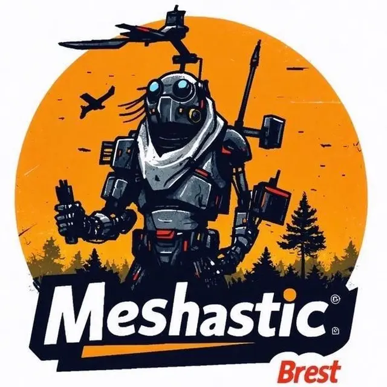
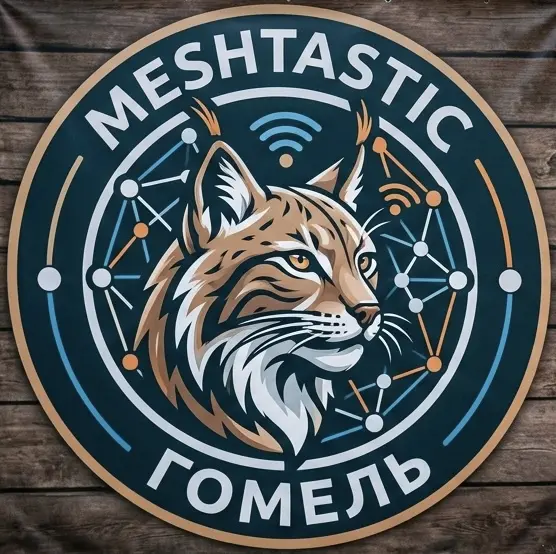
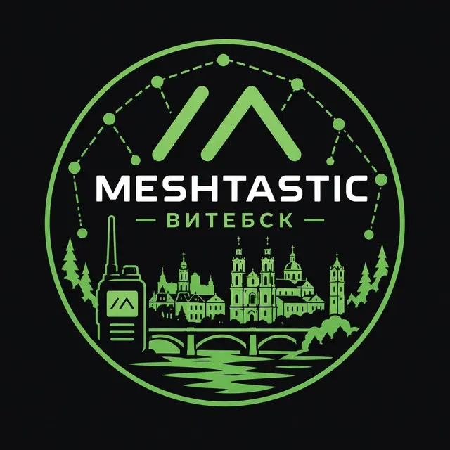
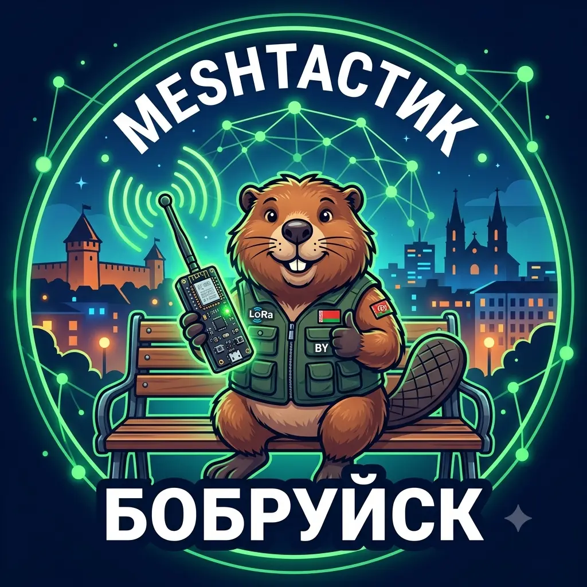

# Meshtastic в Республике Беларусь / Минск    { width="90%" }
---
## О проекте MeshNetBY
Мы интересуемся автономными mesh-сетями и строим сеть на базе платформы [Meshtastic](https://meshtastic.org/) в городе Минск (РБ), которая использует недорогие LoRa-радиомодули для создания беспроводной сети с большой дальностью действия.

Наша цель — создать устойчивую, децентрализованную и сообщественную сеть, которая может обеспечить связь в условиях отсутствия традиционных сетей, поддерживать местные мероприятия и способствовать сотрудничеству между участниками.

Мы не ограничиваемся только [Meshtastic](https://meshtastic.org/) и также изучаем другие реализации mesh-сетей, такие как [MeshCore](https://meshcore.co.uk/) и подобные проекты. Однако на данный момент основное внимание нашего сообщества сосредоточено на развитии и расширении сети Meshtastic в Беларуси.

Мы приветствуем как новичков, так и опытных участников — вместе мы строим независимую сеть связи.

---
### Миграция на MEDIUM_FAST
!!! info "Информация"
    Начиная с 18 мая 2026 года, участники сети переключили свои узлы на предустановленный модем MediumFast. Для получения дополнительной информации о настройке подключенных узлов см. [наше руководство по настройке](/guides/start).

---
### Telegram

Присоединяйтесь к Telegram-сообществам **Meshtastic Belarus (868 MHz)**. Выберите ближайший город, перейдите по ссылке или отсканируйте QR-код.

| Город | Telegram | Логотип | QR-код |
|:------|:---------|:-------:|:------:|
| **Минск (Minsk)** | [Meshtastic Minsk (868 MHz)](https://t.me/+urWsU1L2NDk2YzIy) | { width="160" } | { width="160" } |
| **Брест (Brest)** | [Meshtastic Brest (868 MHz)](https://t.me/meshtastic_brest_868) | { width="160" } | { width="160" } |
| **Гомель (Gomel)** | [Meshtastic Gomel (868 MHz)](https://t.me/meshtastic_gomel) | { width="160" } | { width="160" } |
| **Витебск (Vitebsk)** | [Meshtastic Vitebsk (868 MHz)](https://t.me/meshtastic_vitebsk) | { width="160" } | { width="160" } |

#### Сообщества в других городах

| Область | Город | Telegram | Логотип | QR-код |
|:---------|:------|:---------|:-------:|:------:|
| **Могилёвская** | **Бобруйск (Bobruysk)** | [Meshtastic Bobruysk (868 MHz)](https://t.me/+0giFPCx4_4xiMTQ6) | { width="160" } | { width="160" } |

<!-- - **Meshtastic Минск - Minsk (868 MHz)** [Telegram](https://t.me/+urWsU1L2NDk2YzIy) переходите по ссылке и присоединяйтесь к обсуждению.  
Используйте QR-код ниже, чтобы быстро найти наш Telegram-канал и присоединиться к сообществу!

    { width="300" } { width="300" }

- **Meshtastic Брест - Brest (868 MHz)** [Telegram](https://t.me/meshtastic_brest_868) переходите по ссылке и присоединяйтесь к обсуждению в городе Брест.  
Используйте QR-код ниже, чтобы быстро найти Telegram-канал наших друзей и присоединиться к сообществу!

    { width="300" } { width="300" }

- **Meshtastic Гомель - Gomel (868 MHz)** [Telegram](https://t.me/meshtastic_gomel) переходите по ссылке и присоединяйтесь к обсуждению в городе Gomel.  
Используйте QR-код ниже, чтобы быстро найти Telegram-канал наших друзей и присоединиться к сообществу!

    { width="300" } { width="300" }

- **Meshtastic Витебск - Vitebsk (868 MHz)** [Telegram](https://t.me/meshtastic_vitebsk) переходите по ссылке и присоединяйтесь к обсуждению в городе Vitebsk.  
Используйте QR-код ниже, чтобы быстро найти Telegram-канал наших друзей и присоединиться к сообществу!

    { width="300" } { width="300" }
 -->
